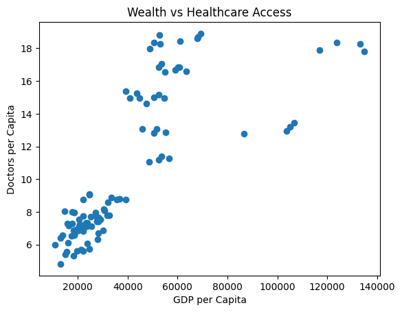
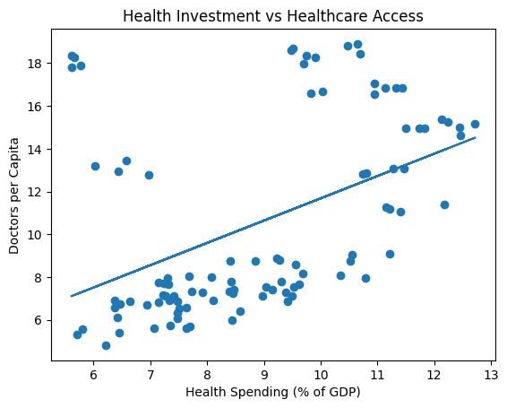
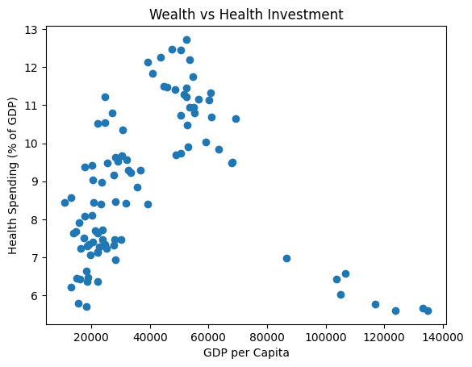
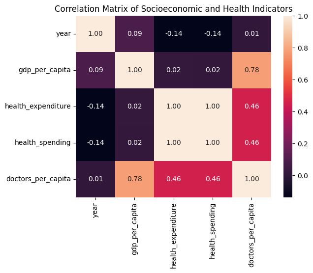

##notes from examples - explain what each of us did in relation to the modules in class, shorter summary (not too long), where the dataset is, how did we get it and licnense, quality and cleaning like accuracy, completeness, timeliness, etc in relation to each set, be as indepth as possible whule also acknowledging needing to be short and brief, be in depth with the reproducability 

# Euros and Years: Does Money Buy a Longer Life in Europe?

## Contributors
- Autumn Rosedale (Data Cleaning Section, Initial Data Analysis, and Reproducability)
- William Neff
- Yuri You (Data Analysis, Data Visualizations, Findings, Future Work, Challenges)

---

## Summary

### Motivation
We chose this topic because understanding the link between economic development and population health is essential not only for academic insight but also for informed travel, living, and working abroad. With personal connections to the European Union and the region’s popularity as a post-graduation destination, we wanted to move beyond surface-level impressions of European countries and examine the actual socioeconomic and health conditions across them. While GDP per capita is often used as a shorthand for a nation’s well-being, important gaps remain in understanding whether wealth alone guarantees better health outcomes—or whether factors like health spending efficiency and regional policy matter more. This project addresses those gaps by systematically analyzing whether economic indicators translate into tangible health system performance across European countries.

### Research Questions
1. How do socioeconomic indicators like GDP per capita and government health expenditure correlate to key public health outcomes like life expectancy and infant mortality across European countries?
2. Are there regional disparities in health outcomes that persist even after accounting for economic factors?

### Overview
We used publicly available secondary data from the World Bank Open Data Portal and the OECD Data Portal, merging socioeconomic indicators (GDP per capita, current health expenditure as a percentage of GDP) with health system metrics (doctors per capita). The dataset spans European countries over multiple years (2000–2024, with GDP data extending to 1960). Our approach involved data cleaning, standardization, and integration using country and year identifiers, followed by exploratory data analysis and visualization. We generated scatter plots, calculated correlation coefficients, and constructed a correlation matrix to examine relationships between economic capacity, healthcare investment, and healthcare access. All data preprocessing and analysis are seen in `data/` and `analysis/` folders.

### Key Findings
- **Wealth strongly predicts healthcare access:** GDP per capita shows a strong positive correlation (0.78) with doctors per capita, indicating that richer European countries tend to have significantly better physician availability.

- **Health spending alone does not guarantee access:** Health expenditure as a percentage of GDP correlates only moderately (0.46) with doctors per capita, with similar-spending countries showing wide variation in outcomes.

- **Wealth does not drive health investment decisions:** There is virtually no correlation (0.02) between GDP per capita and health spending as a percentage of GDP, suggesting that healthcare investment reflects policy choices rather than economic capacity.

- **High-income countries can achieve strong access with modest spending:** Luxembourg and Ireland, for example, maintain high doctors-per-capita levels despite allocating only about 5.6–5.8% of GDP to health, pointing to potential system efficiencies.

These findings suggest that while economic wealth facilitates better healthcare access, policy decisions and institutional efficiency may be equally important for achieving strong health outcomes—a nuance relevant to understanding regional disparities across Europe.

---

## Data Profile

### Dataset 1: Doctors per Capita

| Attribute | Detail |
|-----------|--------|
| **Identifier** | DSD_HEALTH_EMP_REAC@DF_PHYS |
| **Source** | https://data-explorer.oecd.org/vis?fs[0]=Topic%2C1%7CHealth%23HEA%23%7CHealthcare%20human%20resources%23HEA_RES%23&pg=0&fc=Topic&bp=true&snb=15&df[ds]=dsDisseminateFinalDMZ&df[id]=DSD_HEALTH_EMP_REAC%40DF_PHYS&df[ag]=OECD.ELS.HD&df[vs]=1.0&dq=..10P3HB.....P.&pd=%2C&to[TIME_PERIOD]=false&lb=id |
| **License** | Open License assumed CC BY 4.0 - though not explicitly stated on the home page of the data, the OECD Data Policy can be found here (https://www.oecd.org/en/about/oecd-open-by-default-policy.html) |
| **Location in repo** | `data/raw/doctors_per_capita_raw.csv/` |
| **Format** | CSV |
| **Size** | 159 rows x 40 columns > 147 KB |
| **Raw Reference Period** | 1960-2024 |

**Description:**
This dataset contains the number of practicing physicians (doctors) per 10,000 population (or per capita) across OECD member and partner countries. The data comes from the OECD Health Statistics database under the DSD_HEALTH_EMP_REAC@DF_PHYS dataflow, which is part of the broader OECD.Stat health workforce collection. The OECD collects these data to enable cross-country comparisons of healthcare human resources, support health system performance assessments, and inform workforce planning policies. The file covers a wide time range (1960–2024 for some countries), though coverage varies significantly by country.

**Key Variables:**
| Field | Type | Description |
|-------|------|-------------|
| `REF_AREA` | string | Standardized way of presenting the country due from the International Organization for Standardization (ISO) under the ISO 3166 standard. This system provides recognized codes for countries, dependent territories, and special geographic areas |
| `TIME_PERIOD` | integer | The associated Doctors per 10,000 for the respecitive coutnry during the year as presented for standarization |

**Ethical & Legal Constraints:**
This dataset is sourced from the OECD (Organisation for Economic Co-operation and Development) and is typically provided under an open license (e.g., CC BY 4.0 or similar) for non-commercial use with attribution, though specific license terms should be verified on the official OECD website. There are no privacy concerns, as the data are aggregated at the national level and contain no individual or patient information. Several bias and limitation concerns should be noted: (1) Coverage gaps exist, with many countries having incomplete time series, particularly for Eastern European nations in earlier decades. (2) Recent years (2020–2024) frequently contain provisional or estimated values that may be revised. (3) Redistribution is permitted with appropriate attribution to the OECD, but users should verify the exact license terms.

**Relevance to Research Questions:**
This dataset is directly relevant to both research questions. For the first research question (how socioeconomic indicators like GDP per capita and health expenditure correlate with public health outcomes), the doctors per capita measure serves as a key healthcare access / health system resource indicator—a mediating factor between economic capacity and population health outcomes such as life expectancy and infant mortality. By merging this dataset with GDP per capita and health spending data, the project can assess whether wealthier European countries translate economic resources into greater physician availability. For the second research question (regional disparities in health outcomes after accounting for economic factors), this dataset enables country-level comparisons of healthcare workforce capacity, helping to identify whether Eastern and Western European countries with similar GDP per capita exhibit different levels of physician access, which may explain persistent health outcome disparities.

---

### Dataset 2: GDP per Capita

| Attribute | Detail |
|-----------|--------|
| **ID** | NY.GDP.PCAP.CD |
| **Source** | Country official statistics, National Statistical Organizations and/or Central Banks; National Accounts data files, Organisation for Economic Co-operation and Development ( OECD ); Staff estimates, World Bank ( WB ) |
| **License** | CC BY-4.0 |
| **Location in repo** | `data/raw/gdp_per_capita.csv/` |
| **Format** | CSV |
| **Size** | 270 rows x 70 columns > 304 KB |
| **Raw Reference Period** | 1960-2025 |

**Description:**
This dataset contains annual estimates of GDP per capita in current US dollars, measuring the total economic output of a country divided by its population without adjusting for inflation. It covers the period from 1960 to 2024, with data sourced from official national statistics, the OECD, and World Bank staff estimates.

**Key Variables:**
| Field | Type | Description |
|-------|------|-------------|
| `Country Name` | string | Name of country |
| `Country Code` | string | Standardized way of presenting the country due from the International Organization for Standardization (ISO) under the ISO 3166 standard. This system provides recognized codes for countries, dependent territories, and special geographic areas |
| `19xx or 20xx` | int | The associated GDP per capita (meaning dividing the GDP by its population) for the respecitive coutnry during the year as presented for standarization  |

**Ethical & Legal Constraints:**
The dataset is licensed under CC BY-4.0, which allows sharing and adaptation as long as appropriate credit is given to the original sources (country official statistics, OECD, World Bank). There are no privacy concerns since the data consists of aggregated national economic indicators, not individual or household-level information. However, it should should be noted of potential bias due to differences in national statistical methodologies, gaps in data coverage across countries and years, and the fact that current-price estimates do not account for inflation or purchasing power parity, which can distort cross-country comparisons. Redistribution is permitted under the license terms, but the original source and license must be attributed.

**Relevance to Research Questions:**
This dataset is directly relevant to the first research question, as it provides the key socioeconomic indicator of GDP per capita (current US$) , which the project aims to correlate with public health outcomes like life expectancy and infant mortality across European countries. By merging this data with health metrics from the OECD datasets used and government health expenditure indicators, the team can statistically assess whether wealthier European nations tend to have better population health outcomes.

---

### Dataset 3: Health Expenditure

| Attribute | Detail |
|-----------|--------|
| **ID** | SH.XPD.CHEX.GD.ZS |
| **Source** | Global Health Expenditure Database, updated December 12th, 2025, World Health Organization ( WHO ), uri: apps.who.int/nha/database |
| **License** | CC BY-4.0 |
| **Location in repo** | `data/raw/health_expenditure_raw.csv/` |
| **Format** | CSV |
| **Size** | 270 rows x 70 columns > 139 KB |
| **Raw Reference Period** | 2000-2025 (though the recording starts at 1960, no data is received until 2000) |

**Description:**
This dataset contains annual estimates of current health expenditure expressed as a percentage of GDP for countries worldwide, covering the period 2000–2024. It includes spending on healthcare goods and services consumed each year (e.g., hospital care, medications, preventive medicine) but excludes capital investments such as buildings, machinery, or IT infrastructure. The data comes from the World Health Organization (WHO) Global Health Expenditure Database, compiled under the System of Health Accounts 2011 (SHA 2011) framework. The WHO collects these data primarily to support evidence-based health policy-making, track progress toward Universal Health Coverage (UHC) , and monitor Sustainable Development Goal (SDG) target 3.c (strengthening health financing).

**Key Variables:**
| Field | Type | Description |
|-------|------|-------------|
| `Country Name` | string | Name of country |
| `Country Code` | string | Standardized way of presenting the country due from the International Organization for Standardization (ISO) under the ISO 3166 standard. This system provides recognized codes for countries, dependent territories, and special geographic areas |
| `19xx or 20xx` | int | The respective health expenditure as a percentage of their GDP (meaning that the higher percentage, the more poriton of GDP the country spends on their country's health) for the given year |

**Ethical & Legal Constraints:**
The dataset is licensed under CC BY-4.0, permitting sharing and adaptation with proper attribution to the WHO and the Global Health Expenditure Database. There are no privacy concerns, as the data reflect aggregated national-level spending, not individual or household information. However, potential bias should be considered: estimates rely on national reporting, which may vary in accuracy, completeness, and methodological consistency across countries. Additionally, the indicator excludes capital expenditures, meaning it may underrepresent total health investment in countries building new infrastructure, and it does not capture out-of-pocket spending burdens directly. Redistribution is allowed under the license terms, but credit must be given to the original source.

**Relevance to Research Questions:**
This dataset is directly relevant to the first research question, as it provides the second key socioeconomic factor—government/current health expenditure as a percentage of GDP—that the project aims to correlate with public health outcomes like life expectancy and infant mortality across European countries. By merging this dataset with the GDP per capita data and OECD health metrics, the project can statistically assess whether European nations that allocate a larger share of their economy to current health spending tend to have better health outcomes, independent of overall wealth. For the second research question (regional disparities), this dataset helps identify whether countries with similar GDP per capita but different health spending levels (e.g., Eastern vs. Western Europe) exhibit divergent health outcomes, revealing potential policy or systemic differences.

---

### Dataset 4: Health Spending

| Attribute | Detail |
|-----------|--------|
| **License** | DSD_SHA@DF_SHA |
| **Source** | https://data-explorer.oecd.org/vis?fs[0]=Topic%2C1%7CHealth%23HEA%23%7CHealth%20expenditure%20and%20financing%23HEA_EXP%23&pg=0&fc=Topic&bp=true&snb=4&df[ds]=dsDisseminateFinalDMZ&df[id]=DSD_SHA%40DF_SHA&df[ag]=OECD.ELS.HD&df[vs]=1.0&dq=.A.EXP_HEALTH.PT_B1GQ._T.._T.._T...&to[TIME_PERIOD]=false&pd=2015%2C&isAvailabilityDisabled=false&lb=id |
| **License** | Open License assumed CC BY 4.0 - though not explicitly stated on the home page of the data, the OECD Data Policy can be found here (https://www.oecd.org/en/about/oecd-open-by-default-policy.html) |
| **Location in repo** | `data/raw/health_spending_raw.csv/` |
| **Format** | CSV |
| **Size** | 499 rows x 46 columns > 51KB |
| **Raw Reference Period** | 2015-2024 |

**Description:**
This dataset contains annual health expenditure estimates for OECD member and partner countries, structured according to the System of Health Accounts 2011 (SHA 2011) framework. It captures total current health expenditure as a percentage of GDP, representing spending on healthcare goods and services consumed during the year, excluding capital investments. The data is collected through a joint effort by the OECD, WHO, and the European Commission to create a globally standardized framework for tracking financial flows in healthcare — from funding sources to service provision. The dataset covers multiple dimensions including financing schemes, healthcare functions, and providers, though the filtered version focuses on total expenditure.

**Key Variables:**
| Field | Type | Description |
|-------|------|-------------|
| `REF_AREA` | string | Standardized way of presenting the country due from the International Organization for Standardization (ISO) under the ISO 3166 standard. This system provides recognized codes for countries, dependent territories, and special geographic areas |
| `TIME_PERIOD` | date | The associated Health spending as a % of their GDP for the respecitive coutnry during the year as presented for standarization |

**Ethical & Legal Constraints:**
This dataset is sourced from the OECD (Organisation for Economic Co-operation and Development) and is typically provided under an open license (e.g., CC BY 4.0 or similar) for non-commercial use with attribution, though specific license terms should be verified on the official OECD website. There are no privacy concerns, as the data are aggregated at the national level and contain no individual or patient information. Several bias and limitation concerns should be noted: (1) Coverage gaps exist, with many countries having incomplete time series, particularly for Eastern European nations in earlier decades. (2) Recent years (2020–2024) frequently contain provisional or estimated values that may be revised. (3) Redistribution is permitted with appropriate attribution to the OECD, but users should verify the exact license terms.

**Relevance to Research Questions:**
This dataset is directly relevant to the first research question, which investigates how socioeconomic indicators like GDP per capita and government health expenditure correlate with public health outcomes such as life expectancy and infant mortality across European countries. Specifically, the health expenditure as a percentage of GDP is the second key socioeconomic factor in the project's analysis. By merging this dataset with GDP per capita and doctors per capita data, the project can assess: whether countries that allocate a larger share of their economy to current health spending achieve better health outcomes, the relationship between health spending and healthcare access (doctors per capita), Whether health spending reflects national policy priorities rather than simply economic wealth. For the second research question (regional disparities in health outcomes after accounting for economic factors), this dataset enables examination of whether Eastern and Western European countries with similar GDP levels allocate different shares of their economies to healthcare, potentially explaining persistent health outcome disparities.

---

## Data Quality

### Assessment Approach
We assessed data quality and performed cleaning using **OpenRefine**, a powerful open-source tool for data wrangling and transformation. The complete cleaning workflows are documented in the following JSON files in the `clean/` folder in the repository

Our assessment process involved the following steps:

1. **Initial exploration:** We loaded each raw dataset into OpenRefine to examine column structure, data types, missing values, and overall consistency.
2. **Column removal:** We removed extraneous metadata columns (e.g., `STRUCTURE`, `STRUCTURE_ID`, `OBS_STATUS`, `CURRENCY`, `DECIMALS`) that were not needed for analysis, as documented by the repeated `core/column-removal` operations in each JSON file.
3. **Column renaming:** We renamed key columns for clarity and consistency across datasets (e.g., `Reference area` → `country`, `TIME_PERIOD` → `year`, `OBS_VALUE` → `health_spending`).
4. **Data transformation:** For the World Bank datasets (GDP per capita and health expenditure), we transposed the data from **wide format** (years as separate columns) to **long format** (rows of country-year pairs) using the `core/transpose-columns-into-rows` operation.
5. **Standardization:** We applied `core/mass-edit` operations to standardize country names (e.g., "China (People's Republic of)" → "China", "Slovak Republic" → "Slovakia" and then back to "Slovak Republic" for consistency with other datasets).
6. **Filtering:** We used `core/row-removal` with list facets to filter the data to **27 European countries** of interest for the project, removing all non-European and non-target countries.
7. **Missing value handling:** The `fill-down` operation was used to propagate country names down through transposed rows, ensuring each row had a valid country identifier. Blank cells were ignored during transposition (`ignoreBlankCells: true`).

All cleaning steps are fully reproducible by importing the JSON operation files into OpenRefine and applying them to the original raw data files.

### Dataset 1: Doctors per Capita
**Comparison of Raw vs. Cleaned:** The raw file (`doctors_per_capita_raw.csv`) contained OECD health workforce data for all OECD countries with extensive metadata columns. The cleaned file (`doctors_per_capita.csv`) was filtered to European countries and only includes rows where `HEALTH_PROF` = `PHYS` (physicians) and `UNIT_MEASURE` = `10P3HB` (per 10,000 population), with columns standardized.

- **Completeness:** The raw file contained many non-European countries (e.g., AUS, CAN, COL, CRI, ISR, JPN, KOR, MEX, NZL, USA, BRA, IDN, PER, RUS, ZAF) that were filtered out. After filtering to European countries, completeness is variable: some countries have long time series (e.g., Austria, Belgium, Czechia from 1960s onward), while others have limited years (e.g., France only from 2021–2023, Ireland from 2015–2024). The cleaned file shows data primarily from 2020–2024 for most European countries.
- **Consistency:** Raw data had extensive metadata columns (`STRUCTURE`, `STRUCTURE_ID`, `AGE`, `SEX`, `WORKER_STATUS`, `OBS_STATUS`, etc.) that were removed. The OpenRefine workflow standardized column names (`Reference area` → `country`, `TIME_PERIOD` → `year`, `OBS_VALUE` → `doctors_per_capita`). However, note that the cleaned file does not document the unit of measure (which is per 10,000 population, not per 1,000 as implied by the column name).
- **Accuracy:** Values range from approximately **2.4 (Mexico) to 21.4 (Norway)** . The raw file contained `OBS_STATUS` flags (e.g., `P` for provisional, `E` for estimated, `B` for time series break, `D` for definition differs) that were removed during cleaning. This is a significant issue because definitional differences between countries (e.g., whether "practicing physicians" includes only active practitioners or all licensed physicians) affect cross-country comparability.
- **Duplicates:** No duplicate rows were detected after filtering and cleaning. The raw file had unique combinations of dimensions, and the row-removal operation filtered to specific European countries and `HEALTH_PROF` = `PHYS`.
- **Other issues:** The most significant issue is the **loss of unit information** and **status flags**. The raw `UNIT_MEASURE` column indicated `10P3HB` (practicing physicians per 10,000 population), but the cleaned file's column name `doctors_per_capita` is ambiguous. Additionally, all `OBS_STATUS` flags (indicating provisional values, definitional differences, time series breaks) were removed, making it impossible to assess data quality or comparability across countries. For example, Ireland (2022), Slovenia (2022–2023), and many values for France, Germany, and Greece have definitional differences or provisional statuses that are now invisible to analysts.

### Dataset 2: GDP per Capita
**Comparison of Raw vs. Cleaned:** The raw file (`gdp_per_capita_raw.csv`) contained data for all countries globally from 1960–2025 in wide format (years as separate columns). The cleaned file (`gdp_per_capita.csv`) was filtered to 27 European countries and transformed to long format (country, year, gdp_per_capita).

- **Completeness:** Raw data had extensive missing values for early years (1960–1985) across many European countries (e.g., Bulgaria, Croatia, Estonia, Lithuania, Romania, Slovakia, Slovenia lacked data before 1980–1995). After filtering to European countries and years 1990–2024, completeness improved significantly, with nearly all targeted country-year pairs populated. Missing values remain for some Eastern European countries in the early 1990s.
- **Consistency:** Raw data had inconsistent column naming (e.g., "Data Source", "Last Updated Date" as initial rows). Country names were consistent (e.g., "Czechia", "Slovak Republic"). The OpenRefine workflow standardized column names (`country`, `year`, `gdp_per_capita`) and transposed years from wide to long format, resolving structural inconsistencies. GDP values are uniformly expressed in current US dollars.
- **Accuracy:** Values are within plausible ranges (e.g., Austria from ~$940 in 1960 to ~$58,000 in 2024; Luxembourg from ~$2,200 in 1960 to ~$137,000 in 2024). No obvious negative values or extreme outliers were detected. However, users should note that current US$ estimates do not account for inflation or purchasing power parity (PPP), which may distort cross-country comparisons.
- **Duplicates:** No duplicate rows were found after cleaning. The raw wide format had unique country-year combinations implicitly; after transposition to long format and filtering, each `(country, year)` pair appears at most once.
- **Other issues:** The raw file included metadata rows (e.g., "Data Source", "Last Updated Date") that were removed during cleaning. The OpenRefine operation filtered to 27 specific European countries, meaning results are not generalizable globally. Former Eastern bloc countries have limited historical coverage prior to 1990 due to data availability.

### Dataset 3: Health Expenditure
**Comparison of Raw vs. Cleaned:** The raw file (`health_expenditure_raw.csv`) contained World Bank data for all countries from 1960–2025 in wide format. The cleaned file (`health_expenditure.csv`) was filtered to 27 European countries and transformed to long format (country, year, health_expenditure) covering 2000–2024.

- **Completeness:** Raw data had extensive empty cells, particularly for early years and non-reporting countries. After filtering to European countries and restricting to years 2000–2024, completeness is excellent with **no missing values** for the target countries.
- **Consistency:** Raw data contained inconsistent header rows (e.g., "Data Source", "Last Updated Date", "Country Name", "Country Code"). The OpenRefine workflow removed these, renamed columns, and transposed years from wide to long format. The indicator uses a consistent unit of measure (percentage of GDP) across all rows.
- **Accuracy:** Values range from approximately **4.2% (Romania, early 2000s) to 12.7% (Germany, 2021)** , which are plausible for OECD/European countries. No obvious outliers were detected. However, this indicator excludes capital health expenditures (buildings, IT, vaccines for outbreaks), so it may underrepresent total health investment in some countries.
- **Duplicates:** No duplicate rows were detected after cleaning. The transpose operation creates unique `(country, year)` combinations, and row-filtering retained only target countries. The raw file had no duplicate issues.
- **Other issues:** The raw file contained many non-European countries and aggregated regional groups (e.g., "Africa Eastern and Southern", "Euro area") that were removed via filtering. The OpenRefine operation removed status columns (`OBS_STATUS`), meaning users lose visibility into whether later-year values (2023–2024) are provisional or estimated. This could affect interpretation of the most recent years.

### Dataset 4: Health Spending
**Comparison of Raw vs. Cleaned:** The raw file (`health_spending_raw.csv`) contained OECD SHA 2011 health expenditure data for all OECD countries with extensive metadata columns. The cleaned file (`health_spending.csv`) kept only essential columns (`country`, `year`, `health_spending`) and filtered to the same 27 European countries.

- **Completeness:** The raw file contained many non-European countries (e.g., IDN, IND, PER, ARG, USA, CHN, BRA, ZAF). After filtering to 27 European countries, completeness is good, though coverage varies by country and year (e.g., some countries have data only for specific years). The cleaned file shows multiple years per country, typically ranging from 2015–2024.
- **Consistency:** Raw data had extensive metadata columns (`STRUCTURE`, `STRUCTURE_ID`, `OBS_STATUS`, `CURRENCY`, `DECIMALS`, etc.) that were removed. Column names were standardized (`Reference area` → `country`, `TIME_PERIOD` → `year`, `OBS_VALUE` → `health_spending`). Country names were mass-edited for consistency (e.g., "China (People's Republic of)" → "China", "Slovak Republic" → "Slovakia" and back to "Slovak Republic").
- **Accuracy:** Values range from approximately **4.9% (Romania, 2015) to 12.7% (Germany, 2021)** , which are plausible. The raw file contained `OBS_STATUS` flags (e.g., `P` for provisional, `E` for estimated, `B` for time series break) that were removed during cleaning. This means users lose visibility into data quality flags for specific observations.
- **Duplicates:** No duplicate rows were identified after cleaning. The row-removal operation filtered to specific European countries, and the remaining rows have unique `(country, year)` combinations.
- **Other issues:** The OpenRefine workflow removed all status columns (`OBS_STATUS`, `OBS_STATUS2`, `OBS_STATUS3`), which originally indicated provisional values, estimated values, and time series breaks. This information loss could be problematic for interpreting recent years (2022–2024), where many values were flagged as provisional or estimated. Additionally, the unit of measure (`PT_B1GQ` = percentage of GDP) is consistent but not explicitly documented in the cleaned file.

### Summary
The general state of the data after cleaning is **good**, but several important caveats remain.

#### Positive Takeaways
- All four datasets were successfully transformed into clean, analysis-ready long-format tables with standardized columns.
- No duplicate rows were found based on `(country, year)` pairs.
- All numeric values fall within plausible ranges.
- Coverage for recent years (2015–2024) is strong across the 27 European countries.

#### Key Caveats
- **Loss of quality flags:** Status columns (`OBS_STATUS`, etc.) indicating provisional, estimated, or definitionally different values were removed. This is significant because recent years often contain provisional data, and cross-country comparability (especially for doctors per capita) is affected.
- **Limited historical coverage:** Eastern European countries lack GDP data before 1990–1995, limiting long-term trend analysis - though they fall out of the scope for the project, it limits the generalizability and future work of the project.
- **Filtered scope:** Data was filtered to 27 European countries; results are not globally generalizable.

---

## Data Cleaning
<!-- Target: max 1,000 words -->

> Scripts: [`scripts/clean_data.py`](scripts/clean_data.py) <!-- update as needed -->

### Operation 1: [e.g., Remove duplicate records]
- **Issue:** [What problem did this address?]
- **Action:** [What did you do, specifically?]
- **Script/Tool:** [`scripts/clean_data.py`](scripts/clean_data.py), lines XX–XX

### Operation 2: [e.g., Standardize date formats]
- **Issue:** [...]
- **Action:** [...]
- **Script/Tool:** [...]

### Operation 3: [e.g., Handle missing values]
- **Issue:** [...]
- **Action:** [...]
- **Script/Tool:** [...]

### Operation 4: [e.g., Normalize column names]
- **Issue:** [...]
- **Action:** [...]
- **Script/Tool:** [...]

<!-- Add more operations as needed -->

### OpenRefine
[If applicable, describe any operations performed in OpenRefine. The JSON recipe should be saved at `scripts/openrefine_recipe.json`.]

---

## Findings

> Analysis and visualizations were generated using:
> [`Analysis/Data_Analysis.ipynb`](Analysis/Data_Analysis.ipynb)

This analysis reflects key stages of the data lifecycle, including data integration, cleaning, and exploratory analysis (Module 2, Module 7, Module 10). By combining secondary data sources from the World Bank and OECD (Module 4), we created a unified dataset to examine relationships between socioeconomic indicators and healthcare access across EU countries. The analysis focuses on GDP per capita, health spending, and doctors per capita, using both visualizations and correlation metrics to support each finding.

---

### **Finding 1: Wealth Is Strongly Associated with Healthcare Access**
A strong positive relationship exists between GDP per capita and doctors per capita, with a correlation coefficient of approximately **0.78**. This indicates that wealthier countries tend to have greater access to healthcare resources, as measured by physician availability. The scatter plot shows a clear upward trend, where countries with higher GDP levels consistently exhibit higher numbers of doctors per capita.

This finding suggests that overall economic capacity plays a significant role in shaping healthcare access, likely due to increased funding availability, infrastructure, and institutional development in wealthier nations.

*Figure 1: Relationship between GDP per capita and doctors per capita.*

### **Finding 2: Health Spending Does Not Guarantee Healthcare Access**
Health spending as a percentage of GDP shows only a **moderate correlation (0.46)** with doctors per capita. While some countries with higher health spending tend to have more doctors, the relationship is much more dispersed compared to GDP. Countries with similar levels of health spending often display significant differences in physician availability.

This suggests that simply allocating a higher proportion of GDP to healthcare does not consistently translate into improved access. Instead, how resources are distributed and managed within healthcare systems appears to play a more significant role than overall spending levels alone.

*Figure 2: Relationship between health spending and doctors per capita.*

### **Finding 3: Wealth Does Not Drive Healthcare Investment Decisions**
There is virtually **no correlation (0.02)** between GDP per capita and health spending as a percentage of GDP. The scatter plot shows no clear pattern, with both low- and high-income countries exhibiting a wide range of health spending levels.

This indicates that wealthier countries do not necessarily allocate a larger share of their economic resources to healthcare. Instead, healthcare investment appears to reflect national policy priorities, institutional structures, and strategic decisions rather than overall economic wealth alone.

*Figure 3: Relationship between GDP per capita and health spending.*

### **Finding 4: High-Income Countries Achieve Strong Healthcare Access Despite Lower Relative Spending**

Country-level analysis further reinforces these findings. For example, Luxembourg, the wealthiest country in the dataset with GDP per capita exceeding $130,000, allocates only about **5.6–5.8%** of its GDP to healthcare while maintaining one of the highest levels of doctors per capita (approximately 18 physicians per capita). Similarly, Ireland exhibits high GDP levels with relatively moderate healthcare spending but still achieves strong physician availability.

These examples demonstrate that high-income countries can maintain strong healthcare access without proportionally high spending, suggesting potential efficiencies or structural advantages within their healthcare systems.

### **Supporting Evidence: Correlation Matrix**

A correlation matrix of all variables confirms these patterns. GDP per capita shows a strong positive correlation with doctors per capita (0.78), while health spending has a weaker relationship (0.46). Additionally, the near-zero correlation between GDP and health spending (0.02) reinforces the conclusion that economic wealth does not directly determine healthcare investment levels.

It is also important to note that health expenditure and health spending are perfectly correlated (1.00), indicating that they represent the same underlying measure and were treated as equivalent variables in the analysis.

*Figure 4: Correlation matrix of key socioeconomic and healthcare indicators.*

---

## Future Work

### Lessons Learned

Throughout this project, we gained a deeper understanding of the complexities involved in working with real-world datasets. While publicly available data from sources such as the World Bank and OECD appear clean at a high level, integrating them revealed challenges related to consistency, completeness, and variable alignment (Module 10, Module 7). We also developed our analytical and problem solving skills when defining our integration scope amd methods. This emphasized that data must be actively managed and refined throughout the data lifecycle rather than assumed to be immediately usable (Module 2).

Additionally, we developed practical experience organizing our workflow into a reproducible pipeline. Using OpenRefine for data integration, as well as using Python for exploratory analysis highlighted the importance of computational reproducibility and transparency (Module 1, Module 14). Ensuring that results could be consistently regenerated using the same data and code reinforced key principles of data curation and documentation.

---

### Limitations

This project highlights several limitations related to data quality and integration. First, the dataset is limited to only four years of data due to the overlap between the World Bank and OECD sources. This reflects a timeliness constraint (Module 10), as the integration process required restricting the dataset to a common time window, limiting the ability to analyze long-term trends.

Second, the analysis relies on secondary observational data (Module 4), meaning that we were not involved in the data collection process. As discussed in lecture, this introduces uncertainty regarding how the data was collected, potential biases, and limitations in accuracy.

Additionally, while the dataset was cleaned and integrated to ensure completeness and consistency (Module 10, Module 7), it does not include key health outcome variables such as life expectancy or infant mortality. This limits the ability to directly evaluate public health outcomes and instead focuses on healthcare access.

Finally, the analysis is based on correlation, which does not establish causation. This reflects a fundamental limitation of observational data (Module 4) and highlights the need for more advanced analytical methods to fully understand underlying relationships.

---

### Potential Extensions

Future work could expand this project in several meaningful ways. One potential extension is to incorporate additional variables, such as life expectancy, infant mortality rates, or education levels, to provide a more comprehensive analysis of public health outcomes. Including these variables would allow for stronger connections between socioeconomic factors and actual health results.

Another extension would be to apply more advanced statistical methods, such as regression analysis, to better understand relationships between variables while controlling for confounding factors. This would move beyond simple correlation and provide deeper analytical insight into the data.

Additionally, expanding the dataset beyond the European Union to include a broader set of countries and a longer timeline would address current limitations related to timeliness and scope (Module 10). This would allow for deeper trend analysis and allow us to generalize our findings better.

Finally, further investigation into outlier countries, such as Luxembourg and Ireland, could provide valuable insights into how certain nations achieve strong healthcare access despite relatively lower proportional spending. This type of deeper analysis reflects the importance of interpreting patterns within observational data rather than relying solely on aggregate trends (Module 4).

---

## Challenges

Throughout this project, we encountered several challenges that directly relate to key concepts in data curation and the data lifecycle (Module 1, Module 2). While many of these issues were expected when working with multiple real-world datasets, actually dealing with them in practice required more time and iteration than we initially anticipated.

One of the primary challenges was addressing data heterogeneity during integration (Module 7). The World Bank and OECD datasets differed significantly in structure, formatting, and variable naming conventions. Even when the datasets were measuring similar concepts, they were often labeled differently or stored in different formats, which made direct merging difficult. We had to spend a considerable amount of time aligning schemas and transforming both datasets into a consistent structure. This process highlighted challenges related to schema mapping and semantic ambiguity (Module 7), where similar indicators do not always translate cleanly across sources. In some cases, we had to make judgment calls about which variables were truly comparable, which introduced a level of subjectivity into the integration process.

Another major challenge involved ensuring data quality across multiple dimensions (Module 10). Because we were combining datasets from different sources, inconsistencies naturally emerged. We encountered missing values, differences in country naming conventions, and occasional discrepancies in reported values. To address this, we went through multiple rounds of data cleaning, including identifying missing or invalid entries, standardizing formats, and verifying the accuracy of merged records. This process reflects key components of data cleaning workflows such as discovery, error detection, and repair (Module 10). Even after cleaning, there was still some uncertainty about whether all inconsistencies had been fully resolved, which is a common issue when working with large, secondary datasets.

The restriction to overlapping years also introduced a timeliness constraint (Module 10). Since the World Bank and OECD datasets did not fully overlap in terms of time coverage, we had to limit our analysis to a smaller time window of four years. While this decision improved consistency and comparability, it reduced the overall depth of our analysis and limited our ability to observe long-term trends. This tradeoff between data consistency and temporal coverage was something we had to carefully consider.

We also faced challenges related to reproducibility and transparency (Module 1, Module 14). Transitioning from exploratory work in a notebook environment to a structured Python script required us to rethink how our code was organized. In the notebook, it was easy to run cells out of order or rely on intermediate variables, but creating a reproducible pipeline meant that everything had to be clearly defined and executable from start to finish. This aligns with the concept of computational reproducibility, where results must be consistently reproducible using the same data, code, and environment (Module 1). Getting to that point required restructuring our workflow and being more intentional about how we wrote and documented our code.

Finally, managing files across local environments and GitHub introduced additional challenges in workflow organization. We had to ensure that all scripts, datasets, and outputs were properly structured so that others could easily navigate and reproduce our work. At times, this was confusing, especially when dealing with file paths, environment differences, and version control issues. However, this process reinforced the importance of proper data curation, documentation, and organization throughout the data lifecycle (Module 1, Module 2). Overall, these challenges were a key part of the learning experience and helped us better understand what it takes to work with real-world data in a structured and reproducible way.

---

## Reproducing
### Files
Here are the files needed for the following:
#### Data Sources
- [World Bank World Development Indicators](https://databank.worldbank.org/source/world-development-indicators)
- [OECD Data Portal](https://data.oecd.org/)

#### Reproducibility Files

Full OpenRefine operation histories are included for each cleaned dataset:

- [GDP Cleaning Operations](data/clean/gdp_openrefine_operations.json)
- [Health Expenditure Cleaning Operations](data/clean/health_expenditure_openrefine_operations.json)
- [Health Spending Cleaning Operations](data/clean/health_spending_openrefine_operations.json)
- [Doctors per Capita Cleaning Operations](data/clean/doctors_openrefine_operations.json)

- [Analysis Notebook](Analysis/Data_Analysis.ipynb)
- [Merged Dataset](data/merged/merged_dataset.csv)

For this project, we used integrated data from the World Bank World Development Indicators (WDI) and OECD Data Portal. We filtered this data to only EU countries. The final merged dataset includes:
1. 25 EU Countries
2. 4 overlapping years (we had originally planned 10, but there was limited overlap across all datasets)
3. 98 observations
4. 0 missing values after integration
5. Variables included:
   1. GDP per capita
   2. Government health expenditure
   3. Health spending
   4. Doctors per capita

Our repository is structured as follows:
project/ ├── Analysis/ │ ├── Data Analysis.ipynb │ ├── data/ │ ├── raw/ │ │ ├── gdp_per_capita_raw.csv │ │ ├── health_expenditure_raw.csv │ │ ├── health_spending_raw.csv │ │ └── doctors_per_capita_raw.csv │ │ │ ├── clean/ │ │ ├── gdp_per_capita.csv │ │ ├── health_expenditure.csv │ │ ├── health_spending.csv │ │ ├── doctors_per_capita.csv │ │ └── README.md │ │ │ ├── merged/ │ │ ├── merged_dataset.csv │ │ └── README.md │ └── README.md

The datasets used were from the World Bank World Development Indicators and the OECD Data Portal. From the World Bank World Development Indicators, we used:
1. GDP per capita
2. Government health expenditure
From OECD Data Portal:
1. Health spending
2. Doctors per capita
You can access these raw source files in: data/raw/

### Data Cleaning
For data cleaning, we used OpenRefine. Full OpenRefine cleaning operations are included in data/clean/openrefine_operations.json. This allows the cleaning workflow (filtering EU countries, standardizing country names, removing inconsistent records, and formatting variables) to be replayed exactly in OpenRefine. The clean files we exported from OpenRefine can be accessed in: data/clean/

The cleaning steps are as follows:
1. Filtered all raw data sources so that the data only consisted of EU countries. We renamed all columns with country data to the "country" column. There should be 25 countries total.
   Final country list:
      Austria, Belgium, Bulgaria, Croatia, Czechia, Denmark, Estonia, Finland, France, Germany, Greece, Hungary, Ireland, Italy, Latvia, Lithuania, Luxembourg, Netherlands, Poland, Portugal, Romania, Slovak Republic, Slovenia, Spain, Sweden.
2. Went through and checked every country name and made sure the spelling was consistent across all the datasets. A naming consistency we had to change was renaming the datasets from "Slovak Republic" to "Slovakia" before merging.
3. We removed all variables we weren't interested in using for analysis. The datasets had columns that contained information we didn't need to use for this project. The remaining variables were "country", "year", and indicator values.
4. Finally, we made sure all datasets had the same format. We checked for duplicates and verified that all numbers were recorded in the correct format. All four datasets overlapped for only 4 years; the final analysis used 4 years rather than the originally planned 10 years.

### Data Inegration
For merging our datasets, we used Python, and our integration can be performed in: Analysis/Data Analysis.ipynb.

Merge:
import pandas as pd

gdp = pd.read_csv("gdp_per_capita.csv")
health_exp = pd.read_csv("health_expenditure.csv")
health_spend = pd.read_csv("health_spending.csv")
doctors = pd.read_csv("doctors_per_capita.csv")

df = gdp.merge(health_exp, on=["country", "year"], how="inner")
df = df.merge(health_spend, on=["country", "year"], how="inner")
df = df.merge(doctors, on=["country", "year"], how="inner")

df.to_csv("merged_dataset.csv", index=False)

df.head()

The shared key we used to merge the datasets was "country" + "year". We did inner joins to only keep overlapping observations. You can find the final merged output in: data/merged/merged_dataset.csv

### Validation
To validate your dataset, there are a couple of sanity checks that should be performed to make sure you have correctly filtered your data. We used:

df.shape
df.isnull().sum()
df["country"].nunique()
df["year"].nunique()

The results from above should be as follows:
   1. 98 rows
   2. 6 variables
   3. 25 countries
   4. 4 years
   5. 0 missing values

### Analysis Reproduction
Run: jupyter notebook Analysis/Data\ Analysis.ipynb

This line will provide you with the analysis we conducted with our merged dataset.

### Software

Install: pip install pandas matplotlib jupyter

## References

<!-- Use a consistent format (APA, Chicago, etc.) -->

1. [Author(s). (Year). *Dataset/Paper title*. Publisher. https://doi.org/...]
2. [Author(s). (Year). *Dataset/Paper title*. Publisher. https://doi.org/...]
3. [Software: e.g., McKinney, W. (2010). pandas. https://pandas.pydata.org]
